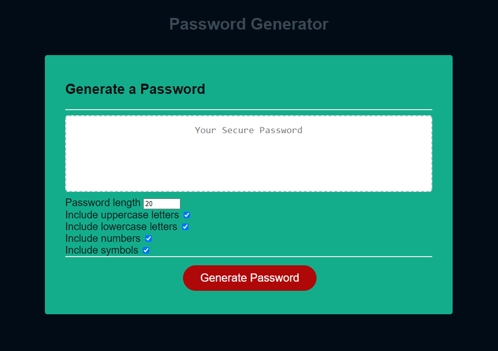

# module-3-challenge

## Description

This is a password generator created to make a password with length of 8 to 128 characters long.
It is made to give the user the choice to include upper case letters, lower case letters, numbers, and special characters.
This application was made to help the user create a complex password.

## Access to Application

[Please click this link to get to the live application. ](https://christopherdoolhoff.github.io/module-3-challenge/)

## Usage

A user can create a complex password at the push of a button. 

The following is a screenshot of the web application.

## License

Please refer to the LICENSE in the repo.
